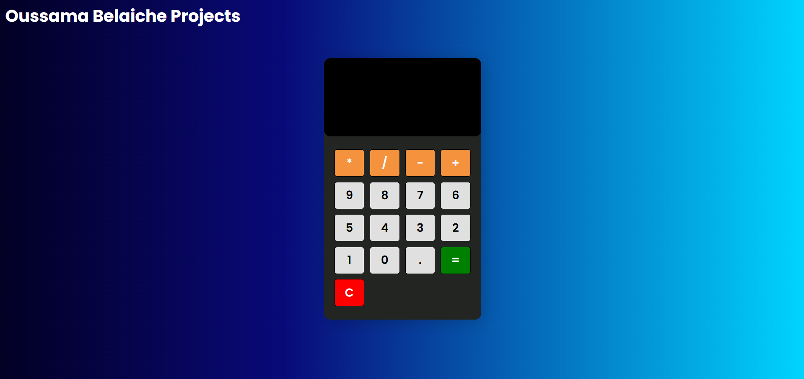

# Calculator

A simple web-based calculator built using **HTML**, **CSS**, and **JavaScript**. This project demonstrates the implementation of basic arithmetic operations and an interactive user interface for performing calculations.

---

## Features

- Perform basic arithmetic operations:  
  **Addition (+)**, **Subtraction (-)**, **Multiplication (*)**, and **Division (/)**.
- **Clear** button to reset the calculator.
- **Decimal point support** for calculations with floating-point numbers.
- User-friendly design with responsive buttons.

---

## Technologies Used

- **HTML5**: For the structure of the calculator.
- **CSS3**: For styling the interface.
- **JavaScript**: For handling the logic and functionality.

---

## Project Structure

```
Calculator/
├── index.html       # Main HTML file for the calculator layout
├── index.css        # Stylesheet for the calculator design
├── index.js         # JavaScript file containing the logic
├── README.md        # Documentation file
```

---

## How to Use

1. **Clone the Repository**:
   ```bash
   git clone https://github.com/Oussama-A-Belaiche/Calculator
   cd calculator
   ```

2. **Open the Application**:
   - Open the `index.html` file in any web browser.

3. **Perform Calculations**:
   - Click numeric buttons to input numbers.
   - Use the operator buttons (**+**, **-**, **×**, **÷**) to perform calculations.
   - Click the **"="** button to display the result.
   - Use the **"C"** button to reset the calculator.

---

## How It Works

1. **Input Handling**:
   - Numbers and the decimal point are appended to the current value.
   - Operators trigger calculations and prepare the calculator for the next operation.

2. **Logic**:
   - The current value, operator, and previous value are managed using JavaScript variables.
   - Arithmetic operations are performed based on user input.

3. **UI Updates**:
   - The screen updates dynamically with each input, showing the current calculation or result.

---

## Demo


---

## License

This project is licensed under the MIT License. See the `LICENSE` file for details.

---

